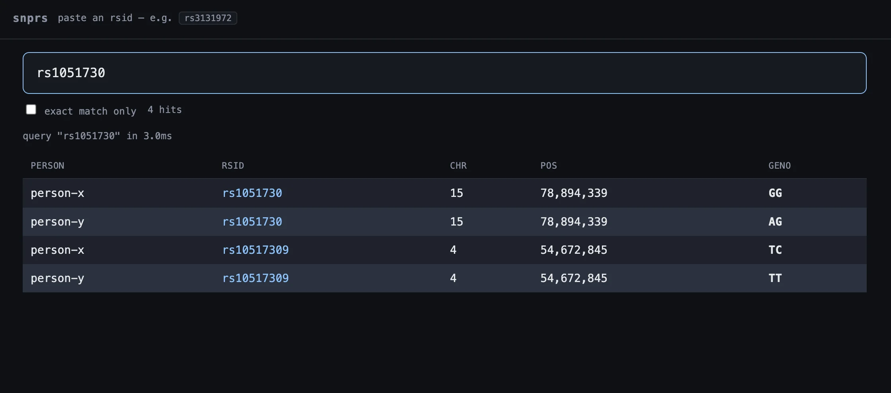
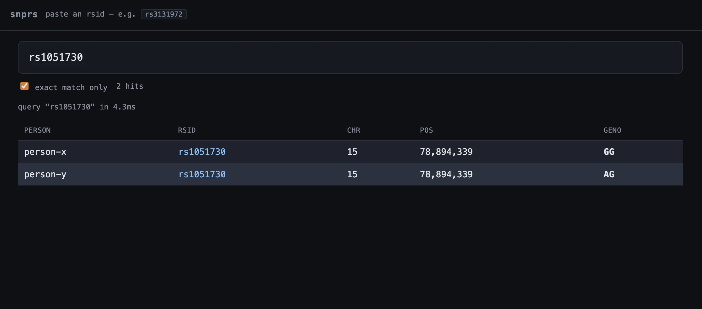
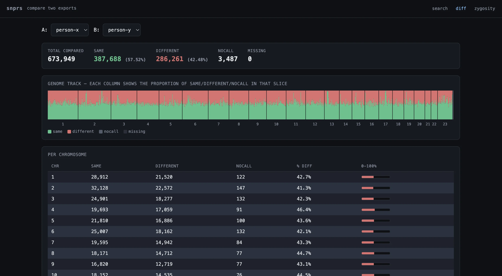
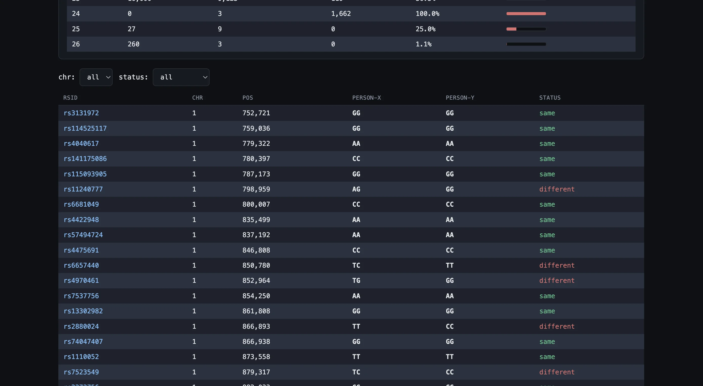
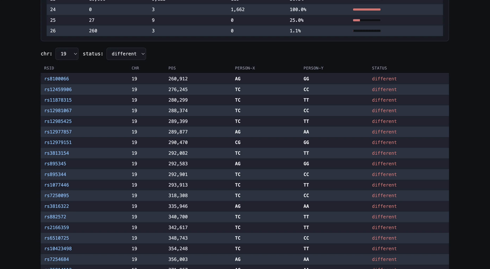
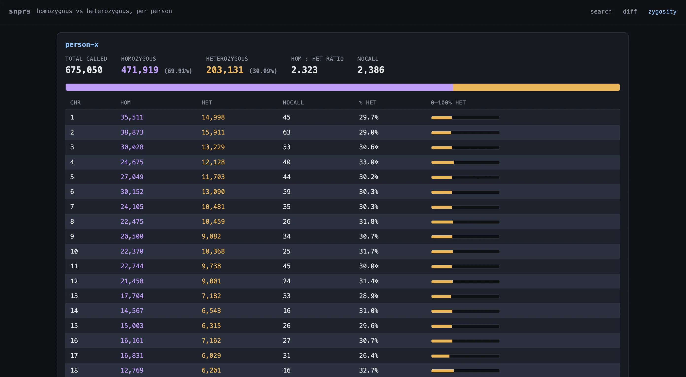

# snprs

paste an rsid, diff two exports, or check zygosity — all local, all instant. for
AncestryDNA raw data.

## setup

1. drop your AncestryDNA.txt files into `exports/`, named per person:

       exports/person-x.txt
       exports/person-y.txt

2. `cargo run --release`
3. open http://127.0.0.1:8080

first run imports each file into lmdb (`lmdb_snps/`). subsequent runs skip
already-imported people (keyed on filename stem). delete `lmdb_snps/` to force
reimport.

## search

paste any rsid prefix — e.g. `rs3131` matches `rs3131972`. tick "exact match
only" for strict.

## diff

at `/diff.html` — pick two people and see where their genotypes agree and
disagree. precomputed on import, so the comparison is instant. shows total
counts and percentages, a per-chromosome breakdown, and a genome-wide track
where each pixel column is a stacked bar of same / different / nocall
proportions in that slice. hover anywhere on the track to pull up the exact
rsid, position, and both genotypes at that spot.

below the fold, a paginated rows table lets you filter the actual diff records
by chromosome and by status (same / different / nocall / missing / all).

## zygosity

at `/zygosity.html` — homozygous vs heterozygous breakdown for each imported
person. shows totals, percentages, hom:het ratio, and a per-chromosome table
with % heterozygous bars. useful sanity check: chr 24 (Y) and 25 (MT) should be
~100% homozygous, and overall hom:het ratio typically lands around 1.7–2.0 for
AncestryDNA's SNP set.

## config

| env             | default          |
| --------------- | ---------------- |
| `SNPRS_BIND`    | `127.0.0.1:8080` |
| `SNPRS_LMDB`    | `lmdb_snps`      |
| `SNPRS_EXPORTS` | `exports`        |
| `RUST_LOG`      | `info`           |

## file format

built for AncestryDNA raw data exports — array version V2.0, converter version V1.0, GRCh37 / build 37.1 coordinates. the parser expects the five TAB-delimited columns ancestry uses: `rsid`, `chromosome`, `position`, `allele1`, `allele2`. lines starting with `#` and the header row are skipped. chromosomes 1–22 are autosomes; 23 = X, 24 = Y, 25 = mitochondrial, 26 = pseudoautosomal regions. no-calls (`0` or `-`) are tracked separately from real genotype calls.

other vendors (23andMe, MyHeritage, etc.) use different formats and aren't supported.